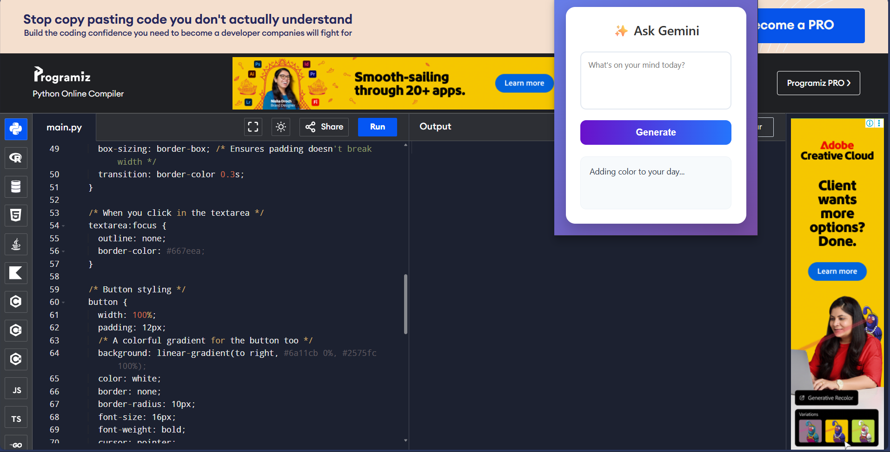
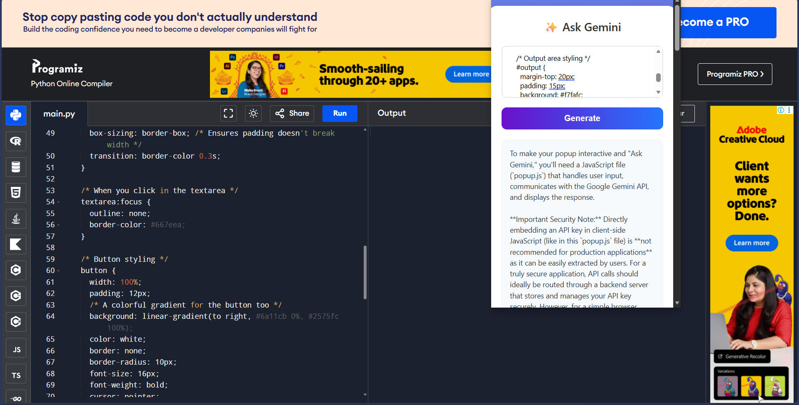

# 🚀 Gemini AI Assistant - Chrome Extension

 

## 📖 Overview
**Gemini AI Assistant** is a powerful browser extension that brings the capabilities of Google's **Gemini 2.5 Flash** model directly to your chrome toolbar. Designed for developers and students, it helps you generate code, debug errors, and write content without ever leaving your current tab.

It features a modern, gradient-based UI and automatic Markdown syntax highlighting for clean code display.

---

## 📸 Screenshots

| **The Interface** | **AI Generating Code** |
|:---:|:---:|
|  |  |
| *Clean, modern UI ready for queries* | *Formatted code generation with syntax highlighting* |

---

## 🌟 Key Features
* **⚡ Instant Access:** Lives in your browser popup for quick queries.
* **🧠 Smart AI:** Powered by the latest **Gemini 2.5 Flash** model.
* **🎨 Syntax Highlighting:** Automatically formats Python, JS, C++, and other code blocks using `Marked.js`.
* **🌈 Modern UI:** A responsive, colorful interface designed for ease of use.
* **🔒 Secure:** API Key is handled locally.

---

## 🛠️ Tech Stack
* **Frontend:** HTML5, CSS3 (Flexbox/Grid)
* **Logic:** Vanilla JavaScript (ES6+)
* **Model:** Google Gemini API (via `generativelanguage.googleapis.com`)
* **Library:** `Marked.js` (for Markdown parsing)

---

## ⚙️ Installation Guide

1.  **Clone the Repository**
    ```bash
    git clone [https://github.com/yashkharmale4/Gemini-Extension-Hackathon.git](https://github.com/yashkharmale4/Gemini-Extension-Hackathon.git)
    ```
2.  **Get Your API Key**
    * Visit [Google AI Studio](https://aistudio.google.com/).
    * Create a new API key.
    * Open `popup.js` and replace `INSERT_YOUR_API_KEY_HERE` with your actual key.

3.  **Load into Chrome**
    * Open Chrome and navigate to `chrome://extensions`.
    * Toggle **Developer Mode** (top right).
    * Click **Load Unpacked**.
    * Select the `Gemini_Extension` folder.

---

## 🚀 Future Improvements
* [ ] Add "Copy to Clipboard" button for code blocks.
* [ ] Add Chat History storage.
* [ ] Voice input support.

---

*Made with ❤️ for the Hackathon by [Yash]*
